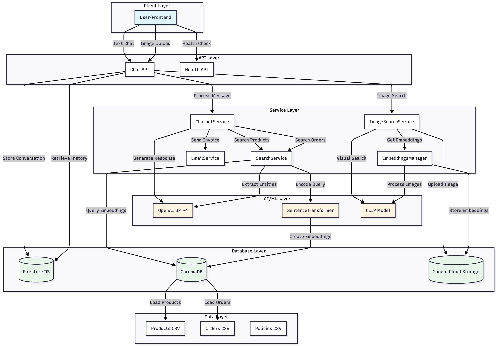

# Essilor Eyewear Chatbot - Backend Documentation

## Table of Contents
1. [Overview](#overview)
2. [Core Features](#core-features)
3. [System Architecture](#system-architecture)
4. [API Endpoints](#api-endpoints)
5. [Key Functionalities](#key-functionalities)
6. [AI/ML Components](#aiml-components)
7. [Database Management](#database-management)
8. [Use Cases](#use-cases)

---

## Overview

The Eyewear Chatbot Backend is an intelligent conversational AI system designed to help customers discover eyewear products, track orders, and get personalized recommendations. It combines natural language processing and semantic search to deliver a seamless shopping experience.

### What This Application Can Do

This backend application provides:
- **Intelligent Product Recommendations** using text and image-based search
- **Order Management** asks for identity
- **Conversational AI** powered by OpenAI GPT-4
- **Visual Product Search** using CLIP image embeddings
- **Order History Tracking** with comparison capabilities
- **Invoice Email Generation** for order confirmations
- **Multi-session Conversation Management** with persistent storage

---

## Core Features

### 1. **Text-Based Product Search**

Users can describe what they're looking for in natural language, and the system will:
- Understand vague or specific requirements
- Search through 49 products using semantic similarity
- Recommend the top 3 most relevant products
- Provide detailed product information including:
  - Product ID, Name, Brand
  - Price with discount percentages
  - Frame type, shape, color, material
  - Lens color and prescription type
  - Suitable face shapes and activities
  - Product images

**Example Queries:**
```
"I need sunglasses for driving"
"Show me gold aviators under 25"
"Looking for cat eye frames for oval face"
"I want reading glasses with blue light protection"
```

### 2. **Image-Based Product Search**

Users can upload an image of eyewear, and the system will:
- Use CLIP (Contrastive Language-Image Pre-training) for visual similarity
- Find the top 4 visually similar products
- Allow users to refine results with text descriptions
- Support hybrid queries like "similar to this image but in black"

**Similarity Threshold:** 0.45 (configurable)

**Example Scenarios:**
```
User uploads photo + "I like this style but need it in a different color"
User uploads photo + "Find something similar but cheaper"
User uploads photo + "Do you have similar models?"
```

### 3. **Order Tracking & Management**

The system provides secure order lookup with:
- **Approach**: Requires Order ID, Email, or Customer Name
- **Order Status Tracking**: Processing, Shipped, Delivered, Cancelled
- **Order History Retrieval**: View past purchases
- **Delivery Information**: Order and delivery dates
- **Product Details**: What was ordered, quantity, customer information

**Supported Order Operations:**
```
"Show my order O1001"
"Track my order for iamlikith19@gmail.com"
"What's the status of Likith Gannarapu's order?"
"When will my order be delivered?"
```

### 4. **Smart Order Comparison**

Unique feature that allows users to:
- Ask if they've purchased previously recommended products
- Compare recommended Product IDs with order history
- Get clear YES/NO answers with order details
- Prevent duplicate purchases

**Example Flow:**
```
Bot: "I recommend P017, P024, P040"
User: "Did I buy any of these before?"
Bot: (asks for Order ID)
User: "My order ID is O1001"
Bot: "Yes! You ordered P017 (Light Gunmetal Full Rim Aviator)..."
```

### 5. **Invoice Email Service**

Automated invoice generation:
- Sends detailed order confirmation emails
- Includes Order ID, product details, dates, status
- Uses Gmail SMTP for reliable delivery
- Triggered on user request with valid Order ID

**Email Template Includes:**
- Customer name and email
- Order ID and product name
- Quantity and dates (order/delivery)
- Order status
- Company branding (Essilor)

### 6. **Conversation Management**

Sophisticated conversation handling:
- **Session-Based**: Each user has a unique session ID
- **Multi-Conversation**: Users can have multiple conversations per session
- **Persistent History**: All conversations stored in Firestore
- **Context-Aware**: Bot remembers previous recommendations and questions
- **Image Metadata**: Tracks uploaded images with conversations

**Conversation Features:**
- Create new conversations
- Retrieve conversation history
- Delete conversations
- List all conversations for a session
- Auto-generate conversation titles

---

## System Architecture

### High-Level Architecture



---

## API Endpoints

### Chat Endpoints

#### 1. **Text Chat**
```http
POST /api/chat/{session_id}/{conversation_id}
```

**Request Body:**
```json
{
  "user_input": "Show me sunglasses for driving"
}
```

**Response:**
```json
{
  "response": "I recommend these driving sunglasses...",
  "products": [
    {
      "Product ID": "P027",
      "Product Name": "Silver Full Rim Square",
      "Price": 22,
      "Brand Name": "Vincent Chase Polarized",
      "Discount": "10.80%",
      "Activity": "Driving",
      "Face Shape": "Triangle",
      "Product Type": "Sunglasses",
      "Image URL": "https://...",
      "Prescription Type": "No Power",
      "Frame Colour": "Silver",
      "Lens Color": "Brown"
    }
  ],
  "orders": [],
  "conversation_id": "conv_123",
  "session_id": "session_456"
}
```

#### 2. **Chat with Image**
```http
POST /api/chat/{session_id}/{conversation_id}/with-image
```

**Request (Multipart Form):**
- `file`: Image file (JPEG/PNG)
- `user_input`: Text description

**Response:**
```json
{
  "response": "I found glasses similar to your image...",
  "products": [...],
  "orders": [],
  "conversation_id": "conv_123",
  "session_id": "session_456",
  "image_url": "https://storage.googleapis.com/..."
}
```

#### 3. **Get Conversation History**
```http
GET /api/chat/{session_id}/{conversation_id}
```

**Response:**
```json
{
  "messages": [
    {
      "role": "user",
      "content": "Show me sunglasses",
      "timestamp": "2025-01-15T10:30:00",
      "has_image": false
    },
    {
      "role": "bot",
      "content": "Here are some options...",
      "table": [...],
      "timestamp": "2025-01-15T10:30:05"
    }
  ],
  "title": "Sunglasses Search",
  "timestamp": "2025-01-15T10:30:00",
  "products": [...],
  "orders": []
}
```

#### 4. **Delete Conversation**
```http
DELETE /api/chat/{session_id}/{conversation_id}
```

**Response:**
```json
{
  "message": "Chat deleted successfully"
}
```

#### 5. **List All Conversations**
```http
GET /api/chat/{session_id}/conversations
```

**Response:**
```json
{
  "conversations": [
    {
      "conversation_id": "conv_123",
      "title": "Sunglasses Search",
      "timestamp": "2025-01-15T10:30:00",
      "message_count": 8
    }
  ]
}
```

### Health Endpoints

#### 1. **Root Health Check**
```http
GET /api/
```

**Response:**
```json
{
  "message": "Chatbot API is up!!"
}
```

#### 2. **Detailed Health Check**
```http
GET /api/health
```

**Response:**
```json
{
  "status": "healthy",
  "service": "Chatbot API"
}
```

---

## Key Functionalities

### 1. **Intelligent Query Understanding**

The system uses OpenAI GPT-4 to analyze user queries and determine:

**Decision Flags:**
- `run_retrieval_products`: Should we search for products?
- `run_retrieval_orders`: Should we look up orders?
- `send_invoice_email`: Should we send an invoice?

**Smart Detection:**
- Recognizes product searches vs. order queries
- Identifies when users want to compare recommendations with orders
- Detects invoice requests
- Asks clarifying questions for vague queries

**Example Logic:**
```
User: "Show me aviators" 
→ run_retrieval_products = true

User: "What's my order status?"
→ run_retrieval_orders = false (no ID provided)
→ Asks: "Please provide your Order ID"

User: "Send me invoice for O1001"
→ run_retrieval_orders = true
→ send_invoice_email = true
```

### 2. **Semantic Product Search**

**Technology:** SentenceTransformer (all-MiniLM-L6-v2)

**Process:**
1. User query encoded into 384-dimensional vector
2. Cosine similarity computed against 49 product embeddings
3. Top 3 most similar products retrieved
4. Results sorted by similarity score
5. Price-based prioritization when price mentioned

**Product Embeddings Include:**
- Product name, type, brand
- Activity suitability (driving, fashion, business, casual, reading)
- Face shape compatibility (oval, round, square, heart, diamond, triangle)
- Price and discount information
- Frame and lens specifications

**Similarity Scoring:**
```
Similarity Score = 1 / (1 + distance)
Higher score = Better match
```

### 3. **Visual Product Search (CLIP)**

**Technology:** OpenCLIP (ViT-B-32, LAION-2B trained)

**Process:**
1. User uploads image → Preprocessed and uploaded to GCS
2. Image encoded using CLIP → 512-dimensional embedding
3. Cosine similarity with pre-computed product embeddings
4. Products above 0.45 threshold returned
5. Hybrid prompt combines visual + text requirements
6. AI analyzes and recommends best matches

**Hybrid Search Example:**
```
Image Upload: Black aviators
Text: "I want something like this but in gold"

Result: Gold aviators with similar frame shape
```

**Key Feature:** Discount preservation from original embeddings to ensure accuracy

### 4. **Order Search**

**Required Identifiers (at least one):**
- Order ID (e.g., O1001)
- Customer Email (e.g., user@gmail.com)
- Customer Name (full name)

**Entity Extraction:**
Uses OpenAI to extract:
```json
{
  "order_id": "O1001",
  "customer_name": "Likith Gannarapu",
  "email": "iamlikith19@gmail.com"
}
```

**Search Priority:**
1. Order ID (exact match) - Highest priority
2. Email (partial match allowed)
3. Customer Name (case-insensitive partial match)

### 5. **Order Comparison Logic**

**Purpose:** Help users avoid duplicate purchases

**Detection Criteria:**
- Previous bot messages contain product recommendations
- Current query asks about ordering those products
- User provides Order ID for verification

**Comparison Keywords:**
```
"did i buy", "have i ordered", "purchased any",
"bought any of these", "ordered any of these"
```

**Comparison Process:**
1. Extract recommended Product IDs from conversation history
2. User provides Order ID
3. Retrieve user's order history
4. Extract ordered Product IDs
5. Find matches between recommended and ordered
6. Generate YES (with details) or NO response

**Example:**
```
Bot recommended: P017, P024, P040
User ordered: P017, P025, P030

Match found: P017
Bot: "Yes! You ordered P017 (Light Gunmetal Full Rim Aviator)
      Order #O1001, delivered on 18/04/25"
```

### 6. **Conversation Context Management**

**Context Preservation:**
- Bot remembers previously recommended products
- Tracks conversation flow for follow-up questions
- Maintains product and order data in each message
- Supports multi-turn dialogues

### 7. **Email Invoice Service**

**SMTP Configuration:**
- Host: smtp.gmail.com
- Port: 587 (TLS)
- Authentication: App-specific password

**Invoice Content:**
```
Subject: Essilor Order Confirmation - Order ID: O1001

Dear Likith Gannarapu,

Thank you for your order with Essilor!

Order Details:
- Order ID: O1001
- Product: Light Gunmetal Full Rim Aviator
- Quantity: 3
- Order Date: 15/04/25
- Delivery Date: 18/04/25
- Status: Delivered

Contact support if you have questions.

Best regards,
The Essilor Team
```

**Trigger Conditions:**
- User explicitly requests invoice
- Valid Order ID provided
- Order found in database

---

## AI/ML Components

### 1. **OpenAI GPT-4**

**Model:** `gpt-4o` (configurable)

**Use Cases:**
- Query intent classification
- Conversational response generation
- Product recommendation explanations
- Order comparison responses
- Entity extraction (Order ID, Email, Name)
- Hybrid search analysis (image + text)

**Prompt Engineering:**
- System prompts define chatbot personality
- Few-shot examples for structured outputs
- JSON response formatting
- Context injection from conversation history

### 2. **SentenceTransformer**

**Model:** `sentence-transformers/all-MiniLM-L6-v2`

**Specifications:**
- Embedding dimension: 384
- Context length: 256 tokens
- Trained on 1B+ sentence pairs

**Use Cases:**
- Product description embeddings
- Order description embeddings
- User query embeddings
- Semantic similarity computation


---

## Database Management

### 1. **Firestore (NoSQL)**

**Collections Structure:**
```
chat_sessions/
  {session_id}/
    conversations/
      {conversation_id}/
        - messages: []
        - title: string
        - timestamp: timestamp
        - last_updated: timestamp

```

### 2. **ChromaDB (Vector Database)**

**Storage:** Persistent local storage (`./chroma_db`)

**Collections:**

**Products Collection:** `A_2847645678`
- 49 product embeddings
- Metadata: All product attributes
- Embedding dimension: 384

**Orders Collection:** `B_237676564354`
- 30 order embeddings
- Metadata: All order details
- Embedding dimension: 384

**Operations:**
- `query_products()`: Semantic search
- `get_all_orders()`: Fetch all orders
- `get_product_by_id()`: Lookup by Product ID
- `populate_products()`: Initial data load
- `populate_orders()`: Initial data load

**Metadata Storage:**
```python
# Products
{
  "Product ID": "P001",
  "Product Name": "...",
  "Price": 65.0,
  "Discount": "12.50%",  # Stored as percentage string
  "Brand Name": "...",
  "Activity": "...",
  "Face Shape": "...",
  # ... 12 total fields
}

# Orders
{
  "Order ID": "O1001",
  "Email ID": "...",
  "Product Name": "...",
  "Customer Name": "...",
  "Order Status": "...",
  # ... 10 total fields
}
```

### 3. **Google Cloud Storage**

**Buckets:**

**1. `essilor-eyewear`** (Product Images)
```
images/
  {index}_{product_name}.jpg

embeddings/
  image_features_db.npz
```

**2. `essilor-eyewear-images`** (User Uploads)
```
user_uploads/
  {session_id}/
    {image_id}.jpg

uploads/
  search_{timestamp}_{uuid}.jpg
```

**Operations:**
- Upload product images during initialization
- Store image embeddings for fast retrieval
- Save user-uploaded images
- Serve images via public URLs

**Image Embeddings Storage:**
```python
# NPZ file structure
{
  'embeddings': numpy.ndarray,  # Shape: (49, 512)
  'meta': list[dict]            # 49 product metadata dicts
}
```

---

## Use Cases

### Use Case 1: Product Discovery
```
User: "I need sunglasses for outdoor activities"

System Actions:
1. Encode query with SentenceTransformer
2. Search ChromaDB products collection
3. Retrieve top 3 matches by activity="Outdoor"
4. Generate conversational response with OpenAI
5. Return products with images and details

Response:
- Product recommendations with explanations
- Images, prices, discounts
- Face shape compatibility
- Activity suitability
```

### Use Case 2: Visual Product Search
```
User: [Uploads photo of aviator sunglasses]
      "I like these but want them in gold"

System Actions:
1. Upload image to GCS
2. Encode image with CLIP
3. Find top 4 visually similar products
4. Create hybrid prompt: image results + "gold" requirement
5. OpenAI analyzes and recommends gold aviators
6. Preserve original discount from embeddings

Response:
- Gold aviator recommendations
- Visual similarity preserved
- Text requirements satisfied
```

### Use Case 3: Order Tracking
```
User: "What's the status of my order?"
Bot: "To check your order, please provide your Order ID,
      email, or full name."

User: "My Order ID is O1001"

System Actions:
1. Extract Order ID using OpenAI entity extraction
2. Search ChromaDB orders collection
3. Filter by Order ID
4. Generate order summary

Response:
"Your Order #O1001 for Light Gunmetal Full Rim Aviator
 was delivered on 18/04/25. Quantity: 3"
```

### Use Case 4: Comparison Query
```
Bot: "I recommend P017, P024, P040 for driving"

User: "Did I buy any of these before?"

Bot: "To verify, please provide your Order ID"

User: "O1001"

System Actions:
1. Extract recommended Product IDs from history
2. Retrieve orders for O1001
3. Extract ordered Product IDs
4. Compare: P017 in both lists
5. Generate detailed match response

Response:
"Yes! You ordered P017 (Light Gunmetal Full Rim Aviator)
 Order #O1001, Status: Delivered, Delivery: 18/04/25"
```

### Use Case 5: Invoice Request
```
User: "Send me invoice for my last order O1001"

System Actions:
1. Detect send_invoice_email flag
2. Retrieve order details from ChromaDB
3. Generate email with order information
4. Send via Gmail SMTP
5. Confirm to user

Response:
"Here's your order information... 
 An invoice email has been sent to iamlikith19@gmail.com"
```

### Use Case 6: Multi-turn Conversation
```
User: "Show me cat eye frames"
Bot: [Shows 3 cat eye products]

User: "Any in pink?"
Bot: [Filters to pink cat eye frames]

User: "What about with bifocal lenses?"
Bot: [Shows pink cat eye with bifocal option]

User: "Did I order this before? My Order ID is O1001"
Bot: [Compares with order history]
     "No, your orders are different products..."
```

---
